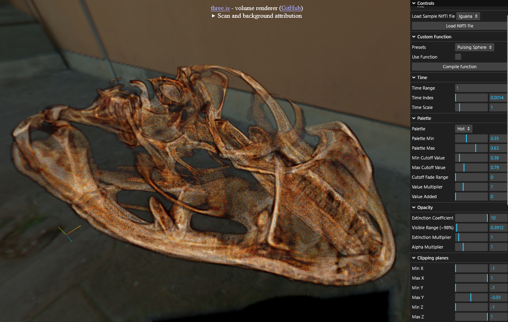
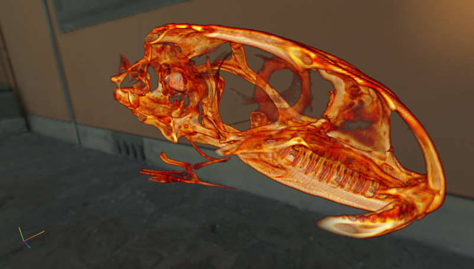

# three.js Volume Renderer

### Try the demo on GitHub pages: [https://donitzo.github.io/three.js-volume-renderer](https://donitzo.github.io/three.js-volume-renderer)

A lightweight volume renderer for [three.js](https://threejs.org/) that uses raymarching to render procedurally defined or data-driven 3D volumes in real time.



## Description

The volume renderer is implemented as a single `VolumeRenderer` class that extends `THREE.Mesh` with a raymarching fragment shader. You can either provide your own 3D volumetric data or supply a custom function in GLSL to create complex procedural shapes or surfaces.

The renderer works as a fullscreen postprocessing effect which renders on top of existing geometry.

The volume renderer features:

- Shader features can be toggled at compile-time using `#define` directives, keeping it lightweight and versatile for different use cases, e.g. for in-game smoke, MRI scans, and other volumetric data.
- Normal estimation for lighting.
- Depth testing.
- Clip planes.
- Color palettes with transparent cutoff range.
- Extinction coefficients for translucency.
- Rendering of static or animated 3D volume data atlas texture. This could for example be an MRI or smoke.

### NIfTI Files

The demo app supports reading [NIfTI](https://brainder.org/2012/09/23/the-nifti-file-format/) files, both 3D and time-varying 4D data.

| Name            | Sample 1                             | Sample 2                            |
|------------------|-------------------------------------|-------------------------------------|
| Iguana           |     |     |
| Chris MRI        |  |  |
| Soot Visibility  |          |  |

## Samples

Below are some sample outputs generated by different distance functions. Each row shows an animated view alongside its corresponding “normals” rendering.

| Name             | Animation                                                         |Normals                                                                  |
|------------------|-------------------------------------------------------------------|-------------------------------------------------------------------------|
| Pulsing Sphere   |                             |                           |
| Square Sphere    |                              |                            |
| Doughnut         |                                   |                                 |
| Rings            |                                      |                                    |
| Twister          |                                    |                                  |
| Gyroid           |                                     |                                   |
| Tunnel           |                                     |                                   |
| Mandelbulb       |                                 |                               |
| Wobbly Sphere    |                              |                            |
| Surface          |                                    |                                  |
| Smoke            |                                      |                                    |

## What is Raymarching?

Raymarching is a rendering technique where, for each pixel, we cast a ray into a scene and advance it in small steps. At each step along the ray, we sample volume data (e.g. density, extinction coefficient, distance function) and accumulate it (e.g., via alpha blending or by estimating a mean value) until the ray exits the volume. Unlike surface-based raymarchers that stop at the first hit, this approach processes the entire volume along the ray.

When alpha blending is used, an extinction coefficient determines how much light is absorbed at each step, allowing you to see through semi-transparent volumes like smoke or mist. If lighting is enabled, we also estimate a normal at each step by computing the forward difference of the volume data, letting you illuminate the volume with directional or point lights.

## Instructions

1. Import the VolumeRenderer (update the three.js import in the file)
   ```js
   import VolumeRenderer from './VolumeRenderer.js';
   ```

2. Add a VolumeRenderer instance to the scene
   ```js
   const volumeRenderer = new VolumeRenderer();
   scene.add(volumeRenderer);
   ```

3. Load or define volume data
   - **Option A**: Call `volumeRenderer.createAtlasTexture(...)` to set up a 3D texture for your data, then fill it with actual values using `volumeRenderer.updateAtlasTexture(...)`.
   - **Option B**: Provide a custom distance function in `volumeRenderer.updateMaterial({ customFunction: myGLSLFunction })`.

4. Update shader defines and uniforms
   - The shader’s behavior is configured by defines, which you can set via `volumeRenderer.updateMaterial(...)`.
   - There are many different uniforms to configure under `volumeRenderer.uniforms`. Look in the class for the documentation.
   - Update these uniforms each frame in your main loop:
     ```js
     volumeRenderer.uniforms.time.value += dt;
     volumeRenderer.uniforms.random.value = Math.random();
     ```

**Note**: Keep in mind that the number of ray steps has a large impact on performance and quality. 32 steps is a reasonable compromise, but it can look okay at even less steps.

## VolumeRenderer API

### updateMaterial(options = {})

Creates a new shader material based on provided options.

#### Parameters
- **options.customFunction** `string|null`
  A custom GLSL function that overrides the default volume sampling.

  When provided, this function is injected into the fragment shader to calculate
  the sampled scalar value at a given voxel position and time step.

  ### Expected Signature
  ```glsl
  float sampleValue(float x, float y, float z, float t) {
    {your custom code goes here, do not include function definition}
    // x, y, z: local position inside the volume (in world-space units relative to volumeOrigin)
    // t:       current time
    // return:  scalar value at that point
  }
  ```
- **options.useVolumetricDepthTest** `boolean` (default: `false`)
  Enables volumetric depth testing (expects `uniform.depthTexture` to be set).

- **options.useExtinctionCoefficient** `boolean` (default: `true`)
  Enables extinction coefficient for alpha blending.

- **options.useValueAsExtinctionCoefficient** `boolean` (default: `false`)
  Uses the sampled value as the extinction coefficient (such as when you use CE as a scalar field).

- **options.usePointLights** `boolean` (default: `false`)
  Enables point lights (normals are estimated, decreases performance).

- **options.useDirectionalLights** `boolean` (default: `false`)
  Enables directional lights (normals are estimated, decreases performance).

- **options.useRandomStart** `boolean` (default: `true`)
  Randomizes ray start position to soften edges.

- **options.renderMeanValue** `boolean` (default: `false`)
  Renders the mean value across the volume instead of alpha blending.

- **options.invertNormals** `boolean` (default: `false`)
  Inverts all surface normals.

- **options.renderNormals** `boolean` (default: `false`)
  Renders surface normals at the first hit (normals are estimated, decreases performance).

- **options.raySteps** `number` (default: `64`)
  Number of ray steps for sampling. Scales linearly with performance.

---

### createAtlasTexture(volumeResolution, volumeOrigin, voxelSize, timeCount, textureFilter = THREE.LinearFilter)

Creates a half-precision 3D atlas texture and updates uniforms.

#### Parameters
- **volumeResolution** `THREE.Vector3`
  3D resolution (voxel count) of one volume.

- **volumeOrigin** `THREE.Vector3`
  3D world-space origin of the volume.

- **voxelSize** `THREE.Vector3`
  Physical 3D size of one voxel.

- **timeCount** `number`
  Total number of timesteps.

- **textureFilter** `number` (default: `THREE.LinearFilter`)
  Texture interpolation mode.

---

### updateAtlasTexture(sampler, timeOffset = null, timeCount = null)

Samples new values into the 3D atlas texture.

#### Parameters
- **sampler** `Function`
  Function signature:
  `(xi:number, yi:number, zi:number, x:number, y:number, z:number, ti:number) => number`

- **timeOffset** `number|null`
  Starting time index (default: `0`).

- **timeCount** `number|null`
  Number of timesteps to update (default: full atlas count).

#### Returns
- **object** containing:
  - `minValue` `number` – minimum sampled value.
  - `maxValue` `number` – maximum sampled value.

## Attribution

- [NIFTI-Reader-JS](https://github.com/rii-mango/NIFTI-Reader-JS) - MIT

- Smoke created using [FDS](https://pages.nist.gov/fds-smv/)
- Skybox by [Paul Debevec](https://www.pauldebevec.com/)
- [Chris MRI](https://github.com/neurolabusc/niivue-images) from McCausland Center for Brain Imaging — [CC BY-NC 4.0](https://creativecommons.org/licenses/by-nc/4.0/)
- [Desert Iguana](https://digimorph.org/specimens/Dipsosaurus_dorsalis/) from Dr. Jessie Maisano, University of Texas High-Resolution X-ray CT Facility Archive 0787 — [CC BY-NC 4.0](https://creativecommons.org/licenses/by-nc/4.0/)

## Feedback & Bug Reports

If there are additional variations you would find useful, or if you find any bugs or have other feedback, please [open an issue](https://github.com/Donitzo/three.js-volume-renderer/issues).
